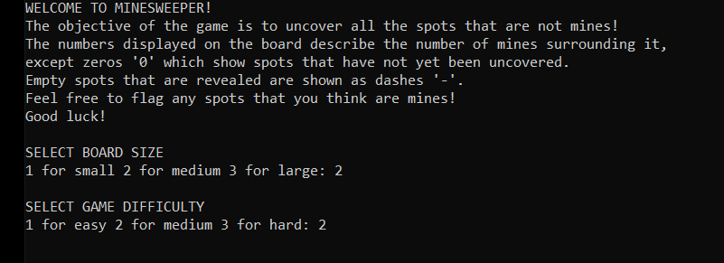
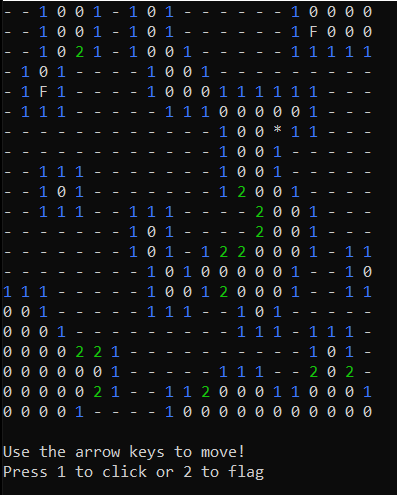
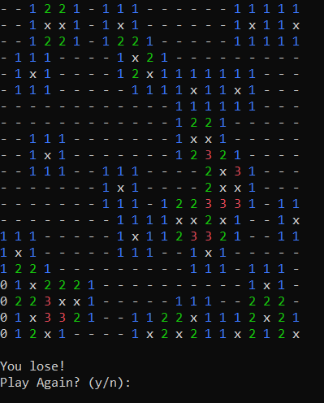

# Minesweeper

### Different Levels of Difficulty ###  
Easy - 4% of the board will contain mines  
Medium - 8% of the board will contain mines  
Hard - 12% of the board will contain mines  
(Insane - 80% of the board will contain mines) &larr; this mode is selected when the player does not enter a proper difficulty

### Gameplay ###  
The numbers represent how many mines surround that cell. The letter "F" represents a flag that is placed by the user. A dash "-" represents an empty cell. The "x"s represent the cells that contain a mine and are revealed if the player lands on a mine, which results in a loss. The player wins if they manage to reveal all the cells that do not contain a mine.

 
